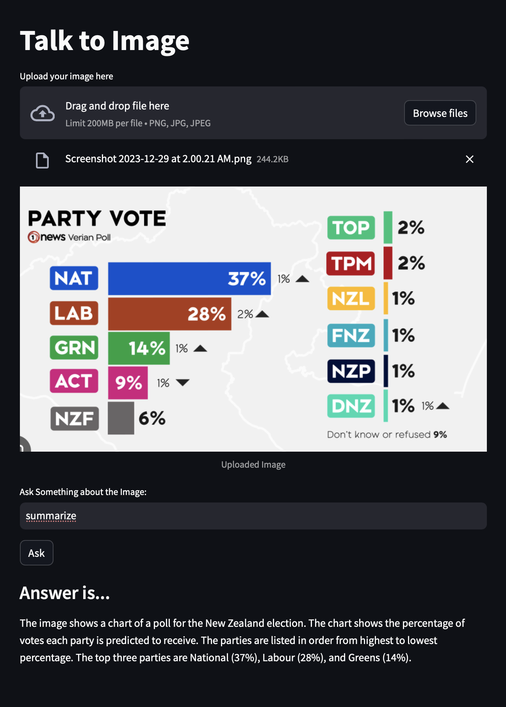

# Description
This App uses Gemini AI Pro FREE API serice to analyze and answer questions.
For the Frontend Streamlit is used for quick turnaround.

# How to Build
- Install Python3.78 or above
- Create venv and insall dependencies from requirements file
- Create .env file with `GOOGLE_API_KEY=akhsd***ASDasd`

# Running on localhost
`streamlit run app.py`

# Sample

